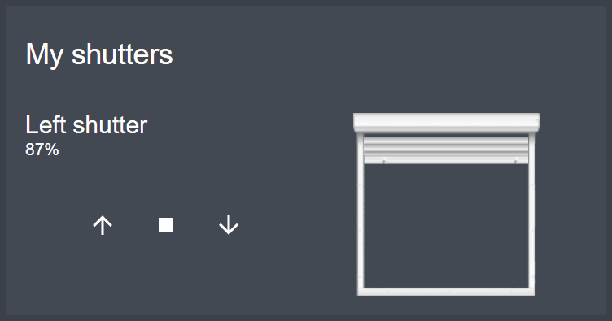

# Shutter card

[](https://github.com/custom-components/hacs)
[](https://www.buymeacoffee.com/Deejayfool)

This card allows to open, close or set a shutter to the opening rate you want.



## Configuration

### General

| Name | Type | Required | Default | Description
| ---- | ---- | -------- | ------- | -----------
| type | string | True | - | Must be "custom:shutter-card"
| title | string | False | `Shutter card` | Title of the card

### Entities

| Name | Type | Required | Default | Description
| ---- | ---- | -------- | ------- | -----------
| entity | string | True | - | The shutter entity ID
| name | string | False | _Friendly name of the entity_ | Name to display for the shutter

_Remark : you can also just give the entity ID (without to specify `entity:`) if you don't want to specify an other friendly name._

### Sample

```yaml
type: 'custom:shutter-card'
title: My shutters
entities:
  - entity: cover.left_living_shutter
    name: Left shutter
  - cover.bedroom_shutter
```

## Install

If you use HACS, the resources will automatically be configured with the needed file.

If you don't use HACS, you can download js file from [latest releases](https://github.com/Deejayfool/hass-shutter-card/releases). Drop it then in `www` folder in your `config` directory. Next add the following entry in lovelace configuration:

```yaml
resources:
  - url: /local/hass-shutter-card.js
    type: module
```